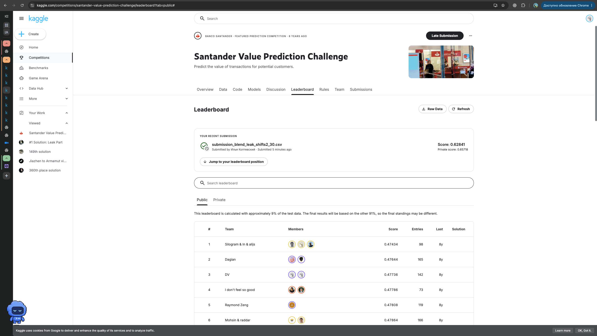

# Santander Value Prediction Challenge — Homework 2

Автор: Илья Коптевский, Kaggle: [ilyakopt](https://www.kaggle.com/ilyakopt).

Соревнование: [Santander Value Prediction Challenge](https://www.kaggle.com/competitions/santander-value-prediction-challenge).

Задача предсказать числовой `target` по анонимизированным признакам. Метрика RMSLE (меньшее значение соответствует лучшему результату)

## Итоговый результат

Финальное решение: восстановление ответов по структурным совпадениям со сдвигами 2–30. Для остальных строк усреднение прогнозов Random Forest и LightGBM в шкале `log1p(target)` с весами 50/50.

- **Public RMSLE: 0.62841.**
- **Private RMSLE: 0.65718.**
- Public RMSLE ниже ранее найденной границы топ-25% публичного лидерборда - около **0.63743**.



Финальный файл: [submission.csv](submission.csv). 

## Подход: baseline → улучшения → финальное решение

1. **EDA.** Изучены размер данных, пропуски, распределение target и статистики признаков. Train содержит 4459 строк и 4991 исходный признак. Target имеет асимметричное распределение. Найдены 256 постоянных признаков; исходные признаки сохранены.
2. **Константный baseline.** Прогноз одинаковый для всех клиентов.
3. **Сравнение моделей.** Проверены Ridge, Random Forest и LightGBM. Для основных моделей использован `log1p(target)`. 
4. **Feature engineering.** Добавлены 10 агрегатов по строке: количество ненулевых значений, среднее, стандартное отклонение, медиана, минимум, максимум, квантили 25% и 75%, межквартильный размах и количество различных ненулевых значений. Статистики значений считаются без нулей; неопределённые агрегаты заменяются нулём. Итоговая матрица содержит 5001 признак.
5. **Подбор параметров.** Использованы GridSearchCV и RandomizedSearchCV. Основная схема CV — `KFold(n_splits=5, shuffle=True, random_state=42)`. Локальная проверка 20% train.
6. **Ансамбли.** Проверены равные и подобранные веса, блендинг с мета-моделью Ridge и стекинг на OOF-прогнозах. Лучший проверенный вариант без восстановления ответов — среднее RF и LightGBM с равными весами.
7. **Структурные совпадения.** Использована одна опубликованная упорядоченная группа из 40 столбцов. Для сдвигов 2–30 ищутся точные совпадения начала одной строки и конца другой. Кандидат на target берётся из соответствующей позиции строки-источника. Фрагменты только из нулей, неоднозначные ключи, совпадения строки с собой и неположительные кандидаты исключаются. Если разные сдвиги предлагают разные ответы, сохраняется прогноз блендинга.
8. **Финальный сабмишен.** RF и LightGBM обучены на полном train. Для Kaggle test рассчитаны те же агрегаты, затем часть прогнозов заменена восстановленными ответами. Поиск не использует скрытые target тестовых строк.

### Параметры финальных моделей

| Модель        | Параметры                                                                                                                    |
| ------------- | ---------------------------------------------------------------------------------------------------------------------------- |
| Random Forest | `n_estimators=100`, `max_depth=16`, `max_features=0.1`, `min_samples_leaf=2`, `random_state=42`                              |
| LightGBM      | `n_estimators=250`, `learning_rate=0.03`, `num_leaves=15`, `min_child_samples=20`, `colsample_bytree=0.8`, `random_state=42` |

## Результаты экспериментов

### Модели и ансамбли на локальной выборке

| Вариант                                   | Локальная RMSLE |
| ----------------------------------------- | --------------: |
| Константа                                 |          1.6963 |
| Ridge с log1p(target), alpha = 10⁹        |          1.6963 |
| Random Forest после подбора, 10 агрегатов |          1.3383 |
| LightGBM после подбора, 10 агрегатов      |          1.3366 |
| Блендинг 50/50, 10 агрегатов              |      **1.3311** |

### Сабмишены Kaggle

| Решение                   | Локальная RMSLE | Public RMSLE | Private RMSLE |
| ------------------------- | --------------: | -----------: | ------------: |
| LightGBM с 3 агрегатами   |          1.3583 |      1.43260 |       1.38215 |
| Блендинг с 10 агрегатами  |          1.3311 |      1.39324 |       1.35203 |
| Поиск 2–10 + блендинг     |          0.7103 |      0.74929 |       0.74804 |
| Поиск 2–20 + блендинг     |          0.6469 |      0.63773 |       0.66877 |
| **Поиск 2–30 + блендинг** |      **0.6069** |  **0.62841** |   **0.65718** |
| Поиск 2–30 + Ridge        |               — |      0.78924 |       0.80045 |

Поиск со сдвигами 2–30 восстановил 3542 ответа train (79.43%) с точностью 99.97% после исключения противоречий. В Kaggle test заменены 7343 прогноза из 49342 (14.88%); для 121 строки с противоречиями оставлен блендинг. Покрытие всех тестовых строк не равно покрытию строк, участвующих в оценке Kaggle.

## Что сработало лучше всего

- Агрегированные признаки: при прежних параметрах LightGBM CV RMSLE снизилась с 1.3984 до 1.3707, локальная RMSLE — с 1.3583 до 1.3421.
- Повторный подбор параметров улучшил обе модели на расширенном наборе признаков.
- Равные веса RF и LightGBM дали улучшение относительно отдельных моделей.
- Наибольший вклад внесло восстановление ответов по структурным совпадениям. Расширение диапазона сдвигов увеличило покрытие и улучшило оценки Kaggle.

## Что не сработало

- Ridge напрямую по признакам не улучшила константу. На исходной шкале target результат был значительно хуже; при обучении на логарифме большая регуляризация приблизила прогноз к константе.
- На наборе с 3 агрегатами подбор весов дал локальную RMSLE 1.3520 против 1.3505 у равных весов.
- Блендинг с мета-моделью Ridge дал 1.3648; базовые модели в этом эксперименте обучались только на 75% локального train.
- Стекинг с Ridge на наборе с 3 агрегатами дал 1.3527 и не улучшил среднее 50/50 (1.3505). На расширенном наборе этот эксперимент не повторялся.
- Замена блендинга обычной Ridge для строк без восстановленного ответа ухудшила Public RMSLE с 0.62841 до 0.78924.

## Воспроизведение

1. Скачать `train.csv`, `test.csv` и `sample_submission.csv` со [страницы данных соревнования](https://www.kaggle.com/competitions/santander-value-prediction-challenge/data) и поместить рядом с `eda.ipynb`.
2. Создать окружение Python (в работе использовался Python 3.11) и установить зависимости:

   ```bash
   python -m pip install numpy pandas scipy matplotlib seaborn scikit-learn lightgbm jupyterlab
   ```

   На macOS для LightGBM может потребоваться OpenMP: `brew install libomp`.

3. Из папки домашнего задания запустить `python -m jupyterlab` и открыть [eda.ipynb](eda.ipynb). Рабочая директория ядра должна содержать CSV: в ноутбуке указано `DATA_DIR = Path(".")`.
4. Выполнить ячейки последовательно с чистого ядра. Ноутбук содержит историю экспериментов, поэтому сначала создаются исходные признаки и модели, затем расширенные признаки и новые поиски параметров.
5. Блоки `add_aggregate_features`, обучения `final_rf`/`final_lgb` и предсказания test создают `submission_blend_extended.csv`. Test читается по 2000 строк — всего 25 частей.
6. Выполнить блоки поиска со сдвигами 2–10, 11–20 и 21–30 последовательно: они дополняют словари результатов. Для поиска выбранные 40 столбцов test читаются целиком, чтобы сопоставлять строки из разных частей файла.
7. Итоговый файл — `submission_blend_leak_shifts2_30.csv`. Перед сохранением ноутбук проверяет порядок ID, отсутствие бесконечностей и пропусков, а также неотрицательность прогнозов. В комплекте сдачи его копия называется `submission.csv`.
8. Загрузить итоговый CSV на Kaggle для получения Public и Private Score. Поздний сабмишен получает оценку без официального места в завершённом соревновании.

Версии библиотек не зафиксированы; сохранённые результаты относятся к окружению автора. При других версиях возможны небольшие отличия. Полный повторный запуск после подготовки README не выполнялся.

## Особенности оценки и источники

Локальный X_test неоднократно использовался для сравнения вариантов и не является независимой финальной проверкой. Поиск использует признаки всех доступных строк train, включая локальную проверочную часть; target подключается только для проверки найденных кандидатов. Качество восстановления на train не гарантирует такое же качество на Kaggle test. Итог использует специфическую утечку данных соревнования; переносимость такого метода на новые реальные данные не установлена.

Порядок 40 столбцов и правило восстановления взяты из опубликованных материалов; в ноутбуке исследована одна группа, а не все группы победителей:

- [Первое место: разбор поиска утечки](https://www.kaggle.com/competitions/santander-value-prediction-challenge/writeups/ml-eak-1-solution-leak-part).
- [Список столбцов в base.py](https://github.com/hukuhuku/Santander/blob/master/base.py).
- [Исходный алгоритм в get_leak.py](https://github.com/hukuhuku/Santander/blob/master/get_leak.py).

